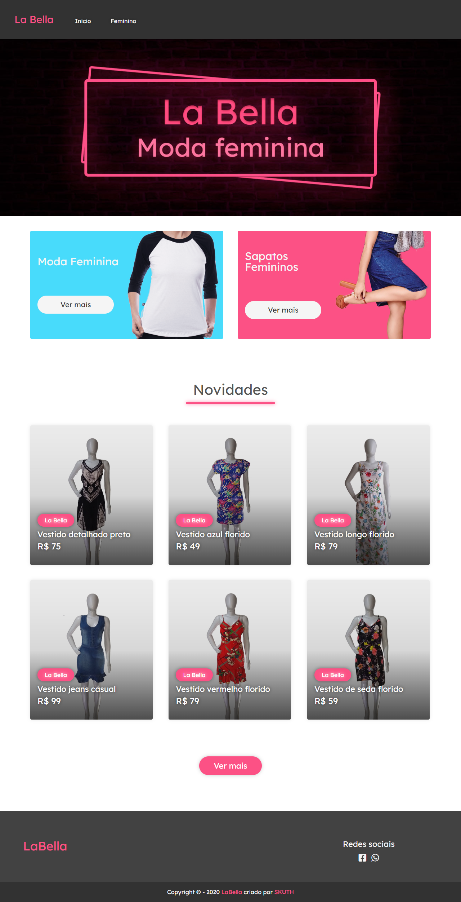

<h1 align="center">
    
</h1>

<p align="center">
  

  

  
</p>

<p align="center">
  
</p>

## 📋 Tecnologias

Esse projeto foi desenvolvido com as seguintes tecnologias:

- [Slim Framework](https://www.slimframework.com/)
- [Rain Tpl](https://github.com/feulf/raintpl3)
- [Sass](https://sass-lang.com/)

## 👨‍💻 Como usar

- Necessário [Composer](https://getcomposer.org/)

- Clonar este respositório:
  ```
  $ git clone https://github.com/Skuth/2M-Atacado
  ```
- Instale o [WampServer](https://www.wampserver.com/en/) ou algum servidor Apache com PHP >= 7.2
- Configure uma **Virtual Host** para o site
- Configure o [Banco de Dados](./db.sql)
- Instale as dependências:
  ```
  $ composer install
  ```
- Crie e configure o arquivo [Config.php](./vendor/skuth/php-classes/src/DB/Sql.php)
- Acesse sua **Virtual Host**

## 📝 Licença

Esse projeto está sob a licença MIT. Veja o arquivo [LICENSE](LICENSE.md) para mais detalhes.